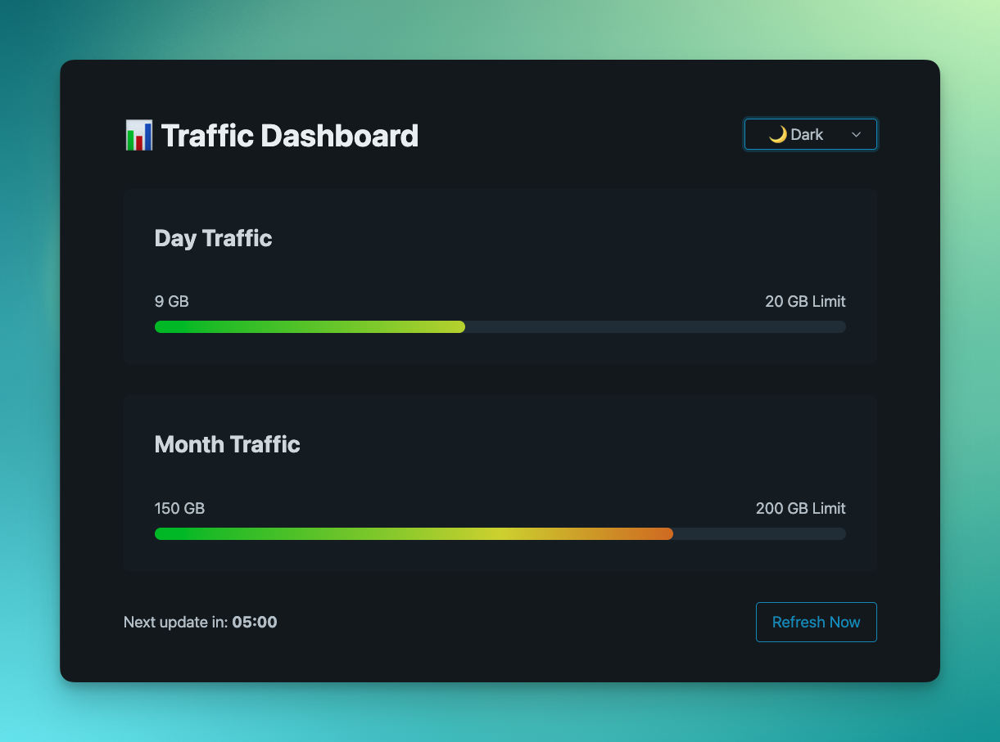
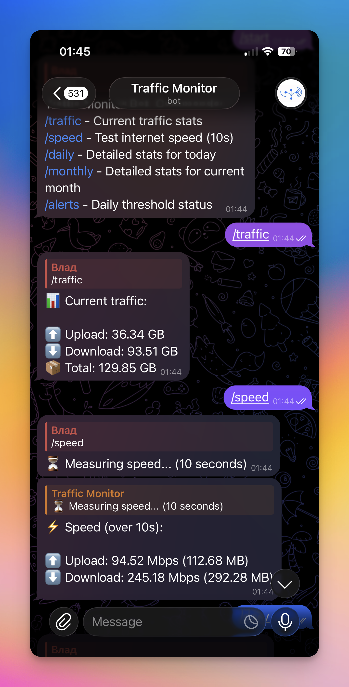

# Traffic Monitor

<p align="center">
  
</p>

<p align="center">
  <a href="https://www.python.org/"></a>
  <a href="https://www.docker.com/"></a>
  <a href="https://core.telegram.org/bots"></a>
  <a href="https://deepwiki.com/KoKa241/upnp-traffic-monitor"></a>
  <a href="LICENSE"></a>
</p>

A lightweight UPnP-based traffic monitoring system for tracking home internet usage. It retrieves real-time bandwidth consumption directly from your router and alerts you via a Telegram bot when daily thresholds are reached. It also includes a Web Dashboard to view traffic statistics.

Available in 🇬🇧 English, 🇷🇺 Русский, and 🇺🇦 Українська.

## Screenshots

| Web Dashboard | Telegram Bot |
| :---: | :---: |
|  |  |

## Features

- **Interactive Setup Wizard**: Configure everything via a friendly terminal interface (`setup.py`) or web setup UI (`web_setup.py`).
- **Telegram Bot Integration**:
  - `/start` - Greeting and verification of access.
  - `/traffic` - Get total accumulated bandwidth usage stats (all-time adjusted stats).
  - `/speed` - Run a live speed measurement directly from your gateway device.
  - `/daily` - Detailed traffic statistics for the current day.
  - `/monthly` - Detailed traffic statistics for the current month.
  - `/alerts` - Display status of today's daily threshold warnings.
- **Web Dashboard**: A simple, auto-refreshing interface that provides visual feedback on daily/monthly traffic limits.
  > You can also easily fetch the statistics programmatically by hitting the `/traffic` JSON endpoint (e.g., `http://<host>:5005/traffic`) for any custom integrations or external scripts.


## Roadmap / In Progress

-  **macOS Client**: Dedicated macOS menubar utility to monitor bandwidth limits.
-  **iOS Widget**: Clean Home Screen widget to check your data usage at a glance.
-  **Extra Goodies**: Statistics charts and exporter support.

## Requirements

- Python 3.10+ (if running without Docker)
- A UPnP-enabled router/gateway
- Telegram Bot Token (from [@BotFather](https://t.me/BotFather))

---

## Installation Options

### Option 1: Native (Without Docker) — Windows, macOS, Linux

1. **Clone the repository and enter the directory.**
2. **Install dependencies:**
   ```bash
   pip install -r requirements.txt
   ```
3. **Run the Setup Wizard:**
   You can configure the application using either a CLI or Web UI.
   - **Web Setup (Recommended)**:
     ```bash
     python web_setup.py
     ```
     Open your browser at `http://localhost:5001` (or your device's local IP address displayed in the console).
   - **CLI Setup**:
     ```bash
     python setup.py
     ```
   *Note: During setup on Linux (e.g., Raspberry Pi OS), you will be asked if you want to create a `systemd` service for autostart.*
4. **Start the application:**
   ```bash
   python main.py
   ```
   *Or, if you installed the `systemd` service:*
   ```bash
   sudo systemctl start traffic-monitor
   ```

### Option 2: Using Docker - Linux Only ⚠️

> [!WARNING]
> **Docker Mode is Linux-Only!**
> The `docker-compose.yml` requires `network_mode: "host"` to discover UPnP devices using multicast SSDP over UDP. Because Docker for macOS and Windows runs inside a virtualized host, host networking is not supported. On macOS and Windows, you must run the application natively (Option 1).

1. **Clone the repository and enter the directory.**
2. **Run the Setup Wizard** to generate the configuration file (`.env`):
   - **On the host system:**
     ```bash
     pip install -r requirements.txt
     python web_setup.py  # Or python setup.py
     ```
   - **Or directly inside a Docker container** (avoids installing python/dependencies on host):
     ```bash
     docker build -t traffic-monitor .
     docker run -it --rm --network host -v $(pwd):/app traffic-monitor python setup.py
     ```
   > ⚠️ **Important:** During setup, when asked to "Create a systemd service", answer **No** (unless running natively on host). Docker will handle auto-starting the container.
3. **If you skipped setup**, create a minimal `.env`:
   ```bash
   cp .env.example .env
   ```
4. **Start the container:**
   ```bash
   docker-compose up -d
   ```

---

## Architecture
- `main.py` - Application orchestrator.
- `app/core/monitor.py` - Core UPnP traffic fetching and SQLite logging logic.
- `app/bot_module/bot.py` - Telegram Bot handlers (aiogram).
- `app/web/server.py` - Flask web API and dashboard.
- `app/core/locale.py` - Multi-language translation dictionaries.

## License
MIT License
